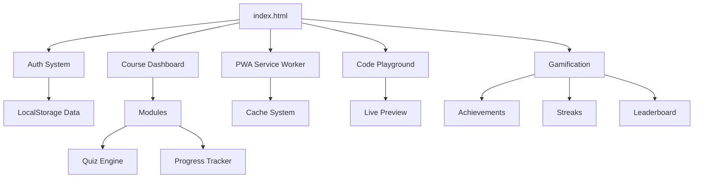

# 🚀 Aprende Web: Do Zero ao Herói

[](https://github.com)
[](LICENSE)
[](https://web.dev/progressive-web-apps/)

Plataforma de e-learning moderna e interativa para aspirantes a Web Developers. Aprende HTML5, CSS3, JavaScript e Angular através de uma metodologia prática e visual.

## 🌟 Funcionalidades Implementadas

### Sistema Completo
- ✅ **Landing Page Premium**: Design moderno e totalmente responsivo com Dark Mode
- ✅ **Sistema de Autenticação**: Login/Registo com validação de email e password
- ✅ **Tracking de Progresso**: Visualização clara de módulos concluídos, quizzes e tempo de estudo
- ✅ **Sistema de Quiz**: 60+ perguntas por curso com feedback imediato
- ✅ **Certificados Digitais**: Geração de certificados em PNG com design profissional
- ✅ **Navegação Mobile**: Menu responsivo com toggle funcional
- ✅ **Acessibilidade (ARIA)**: Labels e roles para leitores de ecrã
- ✅ **SEO**: sitemap.xml, robots.txt e meta tags Open Graph
- ✅ **PWA**: Service Worker, manifest.json, offline support
- ✅ **Code Playground**: Editor de código HTML/CSS/JS com live preview

### Gamificação
- ✅ **Sistema de Conquistas**: 20 badges para desbloquear
- ✅ **Streak System**: Sequência diária de estudo
- ✅ **Leaderboard**: Ranking global com podium
- ✅ **Daily Challenges**: Desafios diários

### Dashboards Interativos
- ✅ **Dashboard HTML5**: Progresso, módulos e certificado
- ✅ **Dashboard CSS3**: Progresso, módulos e certificado
- ✅ **Dashboard JavaScript**: Progresso, módulos e certificado
- ✅ **Dashboard Angular**: Progresso, módulos e certificado

### Conteúdo dos Cursos
- ✅ **HTML5**: 21 módulos completos (modulo-0 a modulo-20)
- ✅ **CSS3**: 21 módulos completos
- ✅ **JavaScript**: 21 módulos completos
- ✅ **Angular**: 21 módulos completos

### Quiz Completo
- ✅ **HTML5**: 63 perguntas (21 módulos × 3 perguntas)
- ✅ **CSS3**: 60 perguntas (20 módulos × 3 perguntas)
- ✅ **JavaScript**: 60 perguntas (20 módulos × 3 perguntas)
- ✅ **Angular**: 60+ perguntas

## 🎯 Objetivos do Projeto
- Democratizar o acesso ao ensino de programação web de qualidade
- Fornecer um caminho claro (roadmap) do básico ao avançado
- Garantir aprendizagem através da prática imediata e quizzes
- Motivar através de gamificação (conquistas, streaks, rankings)

## ✨ Funcionalidades

### Existentes
- **Landing Page Premium**: Design moderno e totalmente responsivo
- **Sistema de Módulos**: Aulas divididas com teoria, prática e quizzes
- **Quizzes Dinâmicos**: Avaliação instantânea com explicações detalhadas
- **Desafios Práticos**: Exercícios com soluções interativas
- **Code Copy**: Botões para copiar exemplos de código
- **Geração de Certificados**: Download de certificado em PNG
- **Modo Escuro**: Toggle de tema com memória persistente
- **Navegação Mobile**: Menu hamburger funcional
- **Acessibilidade**: ARIA labels e roles
- **Code Playground**: Editor HTML/CSS/JS com live preview
- **PWA**: Funciona offline, instalável
- **Conquistas**: 20 badges desbloqueáveis
- **Streak**: Sequência diária de estudo
- **Leaderboard**: Ranking global

### Em Desenvolvimento
- [ ] Integração com Backend real (Supabase/Firebase)
- [ ] Conteúdo de vídeo para todos os módulos

## 🛠️ Explicação Técnica
O projeto utiliza uma arquitetura de **Site Estático de Alta Interatividade** com capacidades PWA e gamificação.



## 📂 Estrutura de Pastas
```text
.
├── css/                    # Estilos (Global, Módulos, Dark Mode)
├── js/                     # Lógica (Auth, Progresso, Certificado, Temas, Quiz)
│   ├── auth.js            # Sistema de autenticação
│   ├── progress.js        # Tracking de progresso
│   ├── certificado.js     # Geração de certificados
│   ├── theme.js           # Gestão de temas
│   ├── streak.js          # Sistema de streak e daily challenges
│   ├── supabase.js        # Integração cloud (preparado)
│   └── quiz*.js           # Dados dos quizzes
├── curso-html5/            # 21 Módulos de HTML5 + Dashboard
├── curso-css/              # 21 Módulos de CSS + Dashboard
├── curso-javascript/        # 21 Módulos de JS + Dashboard
├── curso-angular/          # 21 Módulos de Angular + Dashboard
├── images/                 # Logo, favicon, ícones
├── screenshots/            # Capturas de ecrã
├── pdf/                    # Planos de estudo em PDF
├── pptx/                   # Apresentações PowerPoint
├── sitemap.xml             # Sitemap para SEO
├── robots.txt              # Diretivas para crawlers
├── manifest.json           # PWA manifest
├── sw.js                   # Service Worker
├── playground.html          # Code Playground
├── achievements.html        # Página de conquistas
├── leaderboard.html         # Ranking global
├── 404.html                 # Página de erro
└── README.md               # Este ficheiro
```

## 🚀 Instalação e Execução
1. Clona o repositório.
2. Executa um servidor local: `python3 -m http.server 8000` ou usa a extensão Live Server do VS Code.
3. Abre `http://localhost:8000`.

**Para PWA funcionar (offline):**
- Deve ser servido via HTTPS ou localhost
- A extensão Live Server funciona perfeitamente

## 🔧 Tecnologias
- HTML5 Semântico
- CSS3 (Flexbox, Grid, CSS Variables)
- JavaScript ES6+ (Vanilla)
- LocalStorage API
- Canvas API (para certificados)
- Service Worker API (PWA)
- IndexedDB (via Service Worker cache)

## 📊 Métricas
| Métrica | Valor |
|---------|-------|
| Total de ficheiros HTML | ~100+ |
| Total de linhas de JS | ~3,500+ |
| Total de linhas de CSS | ~1,500+ |
| Questões de quiz | ~250+ |
| Módulos de conteúdo | 84 |
| Dashboards | 4 |
| Conquistas | 20 |
| Ficheiros PWA | 2 |

## 📝 Changelog (2026-03-26)

### Adicionado
- **Sistema de Conquistas**: 20 badges para desbloquear
- **Leaderboard**: Ranking global com podium
- **Streak System**: Sequência diária de estudo com weekly progress
- **Daily Challenges**: Desafios diários rotativos
- **Code Playground**: Editor HTML/CSS/JS com live preview
- **PWA completo**: Service Worker, manifest.json, offline support
- **Dashboard interativos**: HTML5, CSS, JS, Angular
- **Quiz completo**: HTML5 módulos 0-20
- **Sitemap.xml e robots.txt**
- **Validação de formulários**
- **ARIA labels para acessibilidade**
- **Certificado premium**
- **404 page**

### Corrigido
- Removida pasta curso-js redundante
- Corrigida estrutura do Angular
- Removidos PDFs duplicados

---
**Desenvolvido com ❤️ por Sandro Pereira.**
