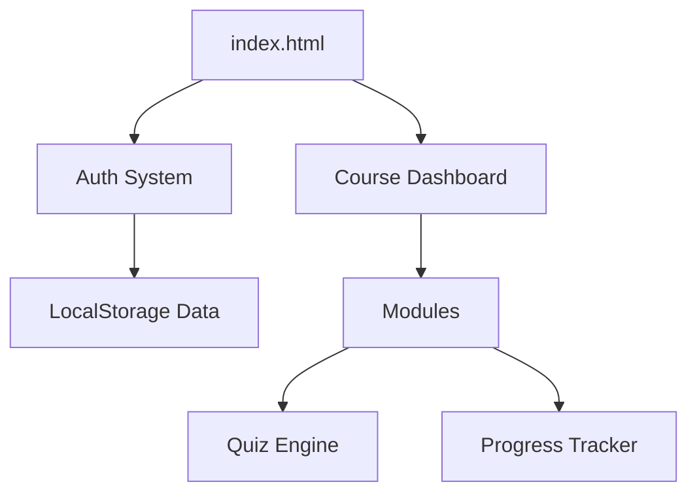

# 🚀 Aprende Web: Do Zero ao Heroi

[](https://github.com/teu-repo)
[](LICENSE)

Plataforma de e-learning moderna e interativa para aspirantes a Web Developers. Aprende HTML5, CSS3, JavaScript e Angular através de uma metodologia prática e visual.

## 🌟 Concluído Recentemente
- ✅ **Curso HTML5 Expandido**: 12 módulos completos com teoria, prática e quizzes.
- ✅ **Sistema de Autenticação Real**: Login e Registo com avatares e persistência de perfil.
- ✅ **Tracking de Progresso**: Visualização clara de quanto falta para terminar cada curso.
- ✅ **Dark Mode Global**: Interface adaptável para maior conforto visual.
- ✅ **Certificados Digitais**: Geração instantânea de certificados após conclusão.
- ✅ **Otimização SEO**: Meta tags configuradas para máxima visibilidade.

## 🎯 Objetivos do Projeto
- Democratizar o acesso ao ensino de programação web de qualidade.
- Fornecer um caminho claro (roadmap) do básico ao avançado.
- Garantir aprendizagem através da prática imediata e quizzes.

## ✨ Funcionalidades

### Existentes
- **Landing Page Premium**: Design moderno e totalmente responsivo.
- **Sistema de Módulos**: Aulas divididas em slides interativos.
- **Quizzes Dinâmicos**: Avaliação instantânea com explicações detalhadas.
- **Desafios Práticos**: Exercícios com soluções interativas.
- **Code Copy**: Botões para copiar exemplos de código.
- **Geração de Certificados**: Download de certificado em PNG.
- **Modo Escuro**: Toggle de tema com memória persistente.

### Em Falta (Roadmap)
- [ ] Sistema de "Sandbox" para testar código no browser.
- [ ] Integração com Backend real (Supabase/Firebase).
- [ ] Conteúdo de vídeo para todos os módulos.
- [ ] Modo Offline (PWA).

## 🛠️ Explicação Técnica
O projeto utiliza uma arquitetura de **Site Estático de Alta Interatividade**.



## 📂 Estrutura de Pastas
```text
.
├── css/                # Estilos (Global, Módulos, Dark Mode)
├── js/                 # Lógica (Auth, Progresso, Certificado, Temas)
├── curso-html5/        # 12 Módulos de HTML5
├── curso-css/          # 20 Módulos de CSS
├── curso-javascript/   # 20 Módulos de JS
├── curso-angular/      # 21 Módulos de Angular
├── screenshots/        # Capturas de ecrã atualizadas
└── PROGRESS.md         # Relatório detalhado de evolução
```

## 🚀 Instalação e Execução
1. Clona o repositório.
2. Executa um servidor local: `python3 -m http.server 8000`.
3. Abre `http://localhost:8000`.

---
**Desenvolvido com ❤️ por Sandro Pereira & Jules.**
