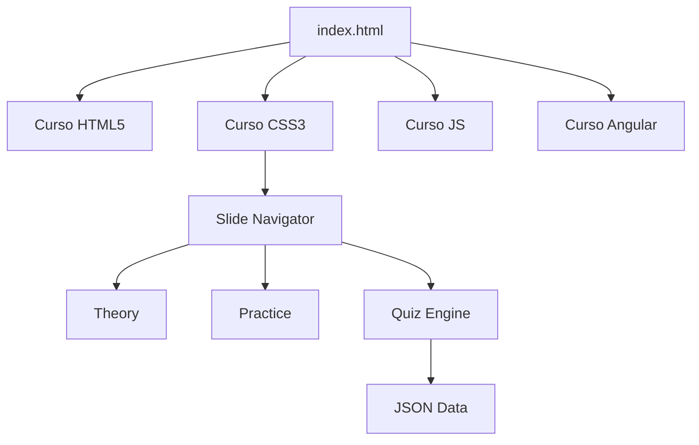
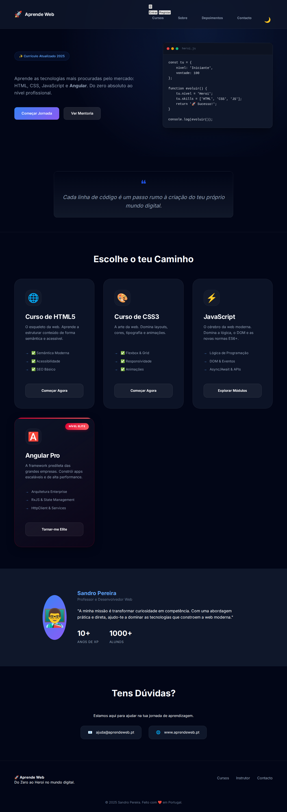
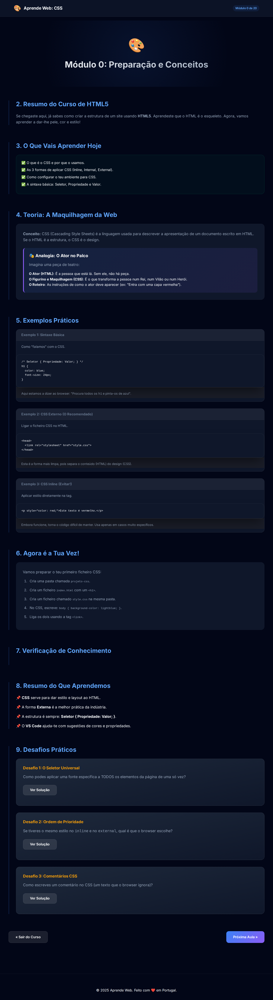
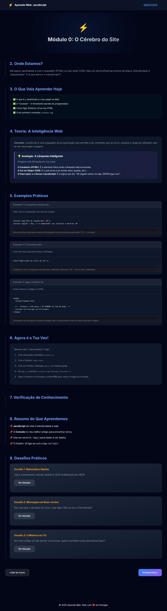

# 🚀 Aprende Web: Do Zero ao Heroi

[](https://github.com/teu-repo)
[](LICENSE)

Plataforma de e-learning moderna e interativa para aspirantes a Web Developers. Aprende HTML5, CSS3, JavaScript e Angular através de uma metodologia prática e visual.

## 🎯 Objetivos do Projeto
- Democratizar o acesso ao ensino de programação web de qualidade.
- Fornecer um caminho claro (roadmap) do básico ao avançado.
- Garantir aprendizagem através da prática imediata e quizzes.

## ✨ Funcionalidades

### Existentes
- **Landing Page Premium**: Design moderno e totalmente responsivo.
- **Sistema de Módulos**: Aulas divididas em slides interativos.
- **Quizzes Dinâmicos**: Avaliação instantânea com explicações detalhadas.
- **Desafios Práticos**: Exercícios com soluções interativas.
- **Code Copy**: Botões para copiar exemplos de código com um clique.
- **Roadmap Completo**: Cobertura de CSS, JS e Angular.

### Em Falta (Roadmap)
- [ ] Conteúdo completo do curso de HTML5.
- [ ] Sistema de autenticação de utilizadores.
- [ ] Persistência de progresso via LocalStorage/Database.
- [ ] Geração automática de certificados de conclusão.
- [ ] Modo Escuro (Dark Mode) global.

## 🛠️ Explicação Técnica

O projeto utiliza uma arquitetura de **Site Estático de Alta Interatividade**.

### Fluxo de Funcionamento
1. O utilizador escolhe um curso na `index.html`.
2. Cada aula (`modulo-x.html`) carrega o `module.js`, que transforma as secções HTML em slides navegáveis.
3. O `quiz.js` lê os dados de `quiz-tech.js` e renderiza as perguntas dinamicamente.



## 📂 Estrutura de Pastas

```text
.
├── css/                # Estilos globais e de módulos
├── js/                 # Motores de Quiz, Navegação e Interação
├── curso-css/          # Conteúdo do curso de CSS
├── curso-javascript/   # Conteúdo do curso de JS
├── curso-angular/      # Conteúdo do curso de Angular
├── curso-html5/        # [EM DESENVOLVIMENTO]
├── pdf/                # Planos de estudo para download
├── screenshots/        # Capturas de ecrã da plataforma
└── index.html          # Porta de entrada principal
```

## 📸 Documentação Visual

### Dashboard Principal


### Interface de Aula (CSS)


### Interface de Aula (JS)


## 🚀 Instalação e Execução

Para correr o projeto localmente:

1. Clona o repositório:
   ```bash
   git clone https://github.com/teu-usuario/aprendeweb.git
   ```
2. Entra na pasta:
   ```bash
   cd aprendeweb
   ```
3. Executa um servidor local (ex: Live Server do VS Code ou via Python):
   ```bash
   python3 -m http.server 8000
   ```
4. Abre o browser em `http://localhost:8000`.

## ⚠️ Problemas Conhecidos
- Os módulos de HTML5 estão atualmente vazios.
- Falta de favicon e alguns assets de imagem (pasta `images/`).
- Navegação direta entre módulos via URL pode falhar se o caminho estiver incorreto.

## 💡 Melhorias Recomendadas
- Integração com uma API para gestão de alunos.
- Implementação de um sistema de "Sandbox" para testar código no browser.
- Melhoria no SEO e Acessibilidade (Auditoria Lighthouse).

---
**Desenvolvido com ❤️ por Sandro Pereira.**
